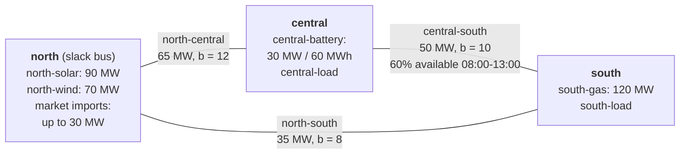

# Security-Constrained Dispatch Checks

`security-check` evaluates N-1 feasibility for a solved nodal dispatch without
mixing contingency metrics into the base-case objective. It keeps the base unit
commitment fixed, then solves an explicit post-contingency DC redispatch LP for
each selected period and contingency.

Supported contingency classes are:

- `lines`: each configured transmission line is removed in turn.
- `generators`: each thermal generator is removed in turn.
- `imports`: the configured import resource is set to zero when selected.

For every contingency, failed components contribute no output or flow. Thermal
redispatch is bounded by the base commitment state, available capacity, ramp
capability, and, by default, the procured upward/downward reserve columns from
the base dispatch. Import redispatch follows the same reserve-column policy when
import reserves are enabled.

Run a check with emergency slack allowed:

```bash
poetry run energy-sim security-check \
  --config configs/portfolio_nodal_three_bus.yaml \
  --output outputs/security \
  --overwrite
```

Run hard N-1 feasibility with no emergency load shedding or overload slack:

```bash
poetry run energy-sim security-check \
  --config configs/portfolio_nodal_three_bus.yaml \
  --output outputs/security-hard \
  --hard \
  --overwrite
```

The `--contingencies` option accepts a comma-separated subset such as
`lines,generators` or `lines,generators,imports`. Use
`--no-committed-reserve-limit` to bound redispatch directly by ramp/headroom
instead of by procured reserve quantities.

## Example Network

`configs/portfolio_nodal_three_bus.yaml` is a meshed three-bus DC network, so
every bus stays connected when any single line is lost. Each box lists the
assets at that bus, and line labels give the rating and susceptance.



The input data derates `central-south` to 30 MW from 08:00 to 13:00 UTC. In the
base dispatch, no line reaches its available capacity: the highest loading is
72.5%, on `north-central`. `central-south` carries power from south to central
in every hour.

Running the first command above on this example checks the default `lines` and
`generators` contingency classes and gives:

| Contingency | Insecure periods | Consequence |
| --- | ---: | --- |
| `generator:south-gas` | 24 of 24 | Up to 120 MW of emergency load shedding |
| `line:north-central` | 15 of 24 | `central-south` and `north-south` overloaded; up to 34.2 MW of emergency overload |
| `line:north-south` | 4 of 24 | `north-central` overloaded, by up to 4.2 MW |
| `line:central-south` | 2 of 24 | `north-south` overloaded, by up to 6.5 MW |

The base dispatch is therefore not N-1 secure. The network has a single
thermal unit, and `north-central` is the line whose loss the other two cannot
absorb in most hours.

## Outputs

The command writes:

- `security_contingencies.csv`: one row per period and contingency, including
  solver status, emergency load shed, emergency overload, redispatch up/down,
  binding overloaded element, and contingency security cost.
- `security_summary.json`: aggregate status, total security cost, maximum
  emergency action, binding contingency, binding period, and the base objective.

`base_costs_are_separate=true` in the summary is intentional. The base dispatch
objective remains the energy and reserve accounting from the original solve;
security cost is a feasibility diagnostic for emergency actions in contingency
states.

## Screening

The default implementation performs explicit checks for all selected outages.
No contingency is screened out silently. If a caller supplies a reduced
contingency tuple through the Python API, that external screening decision should
be documented alongside the resulting files.

## LODF Validation

The Python API includes `lodf_line_outage_flows` and
`explicit_line_outage_flows` helpers. The test suite validates LODF estimates
against explicit DC solves on a meshed three-bus case; use the same comparison
before replacing explicit checks with screened LODF constraints in new studies.
